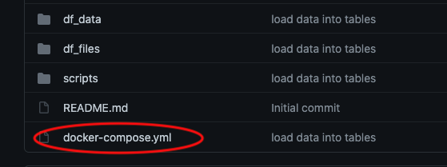
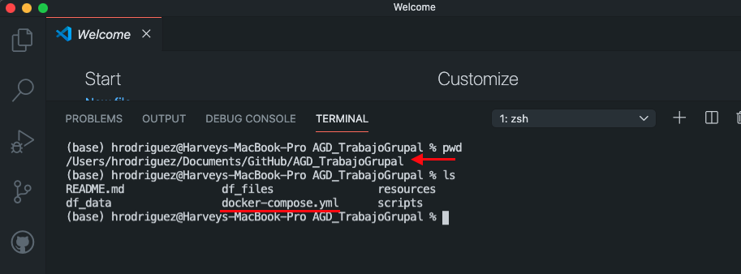
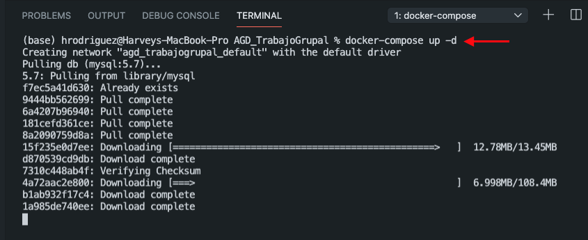
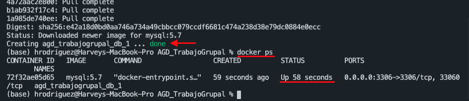
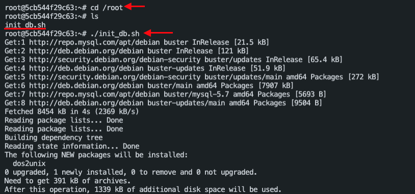
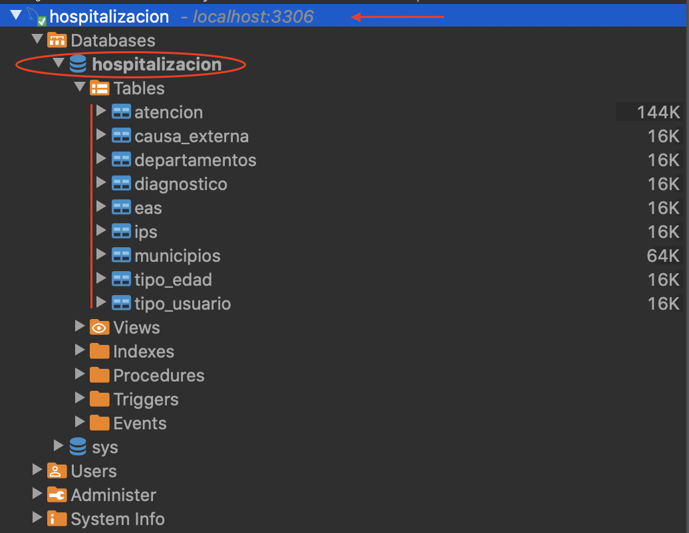

# AGD_TrabajoGrupal

Este repositorio está diseñado con el fin de repasar conceptos sobre base de datos, modelo entidad-relación y otros aspectos del manejo de datos. Para llevar a cabo estas actividades se ha definido utilizar una base de datos MySQL desplegada sobre Docker, para optimizar recursos de las máquinas. A continuación se indica el proceso para dejar funcional la base de datos y comenzar a hacer consultas.

## Fuente de datos utilizada para este ejercicio
El archivo utilizado como fuente de información es [*atenciones en hospitalización*](http://medata.gov.co/dataset/atenciones-en-hospitalizaci%C3%B3n/resource/4c727683-5bf6-4f30-adf7-35b66ba54c26#{view-graph:{graphOptions:{hooks:{processOffset:{},bindEvents:{}}}},graphOptions:{hooks:{processOffset:{},bindEvents:{}}}}), el cual cuenta con la información desde el 2009 hasta el 2017 de las hospitalizaciones realizadas en el departamento de Antioquia.

## Manual para el inicio de la instancia de docker MySQL 5.7
En la raíz del repositorio se encuentra un archivo llamado *docker-compose.yml*:

El cual cuenta con la siguiente información: 
* Versión de base de datos a utilizar: MySQL 5.7
* Base de datos: hospitalizacion
* Usuario: *user*
* Contraseña del usuario y del usuario root
* En la sección de *expose*, le estamos indicando al contenedor que utilizaremos ese puerto desde nuestra máquina física para acceder al contenedor. Esto con ayuda del software DBeaver o MySQL Workbench.
* En la sección de *volumes*, le estamos indicando que tome 3 carpetas de nuestra máquina física para que sean mapeadas en el contenedor

Para iniciar el contenedor, deberemos abrir la terminal de nuestro sistema operativo o desde el propio visual studio code, como se puede ver en la siguiente imagen y dirigirnos a la carpeta donde se encuentra el repositorio:

El comando a ejecutar será **docker-compose up -d**, de esta forma nuestro equipo buscará inicialmente de forma local si contamos con una imagen de docker MySQL 5.7, y de no encontrarla se dirigirá a los repositorios de Internet para descargarla y poder iniciarla:

Una vez finalizada la descarga, docker iniciará el contenedor:

## Pasos iniciales para acceder a la base de datos desde la máquina virtual

Antes de poder utilizar la base de datos por medio del software DBeaver o MySQL Workbench, debemos realizar unos pasos iniciales.

1. Ingresar al contenedor. Para esto ejecutaremos dos comandos:
    * **docker ps** para obtener el ID del contenedor al que nos vamos a conectar
    * **docker exec -it *ID_Obtenido* /bin/bash** para acceder al contenedor

2. Dirigirnos a la carpeta de */root* y ejecutar el script de *init_db.sh*

## Conexión a la base de datos

Una vez completados los pasos anteriores podemos abrir el programa que hemos descargado para acceder a la base de datos. En este caso utilizaremos [dbeaver](https://dbeaver.io/):

Una vez abierto el programa procederemos a crear una nueva conexión de base de datos de tipo MySQL:

Completaremos los datos que nos pide el programa y daremos click sobre el botón de *Test Connection*::

Si nos pide descargar un driver daremos click que OK, y al final deberemos obtener que se ha conectado correctamente:

Por último podremos ver que nuestra base de datos se encuentra en la parte izquierda y podemos desplegar lo que se encuentra en ella (tablas)

Incluso si damos doble click sobre el nombre de la base de datos, podemos ver el esquema ER de la misma:

